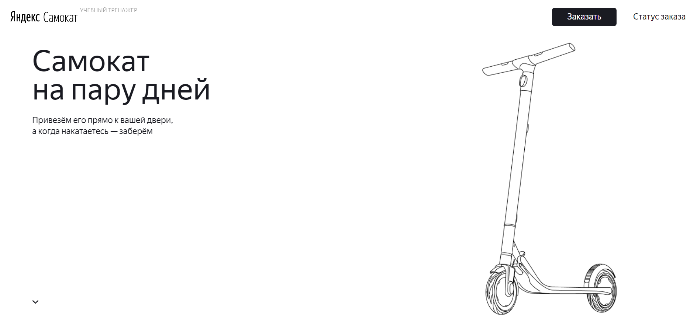

## Проект автоматизации регрессионного тестирования API Яндекс Самокат (учебный тренажер)

- Тесты составлены по документации API в Apidoc, на языке программирования Python
- Для запуска тестов в приложении PyCharm должны быть установлены пакеты: requests и pytest
- Тесты разработаны для позитивных и негативных проверок
- Всего 33 теста, время выполнения тестов - 20 сек.

### Файлы и сценарии проекта:
- configuration.py: URL и пути запросов
- data.py: тела запросов
- sender_scooter_request.py: функции для создания запросов
- ping_server_test.py: проверка подключения к серверу
- new_order_test.py: создание заказа
- get_order_by_track_test.py: получение заказа по номеру
- get_orders_test.py: получение списка заказов
- cancel_order_test.py: отмена заказа
- create_courier_test.py: создание курьера
- courier_login_test.py: получение id курьера
- accept_order_test.py: принятие заказа
- finish_order_test.py: завершение заказа
- delete_courier_test.py: удаление курьера
- stations_search_test.py: поиск станции метро

### Запуск автотестов:
- Указать актуальную ссылку на стенд в URL в файле configuration.py
- Ввести команду pytest в терминале PyCharm - будут запущены все файлы с автотестами (...test.py) проекта